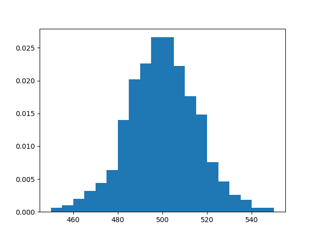

########
Examples
########

.. _clt:

*********************
Central limit theorem
*********************

Let ``X`` be a Bernoulli random variable.

>>> import probly as pr
>>> X = pr.Ber()

We are interested in the sum of many independent copies of ``X``. For this
example, let's take "many" to be 1000.

>>> Z = pr.sum(X, num=1000)     # Returns the sum of 1000 independent copies of X

The sum ``Z`` is itself a random variable, but its precise distribution,
unlike that of ``X``, is unknown.

Nevertheless, the central limit theorem states, roughly, that ``Z`` is
approximately normally distributed. We can check this empirically by plotting
a histogram of the distribution of ``Z``.

The more samples of ``Z`` we use to
produce the histogram, the better an approximation it will be to the variable's
true distribution. But each time we sample ``Z``, we must sample 1000 Bernoulli
random variables and sum the results, so computing a histogram from very many
samples can take a long time. Below we use 1000 samples, but you may want to
reduce this number if running the code takes too long.

>>> pr.hist(Z, samples=1000)

The result resembles the famous bell-shaped curve of the normal distribution.

