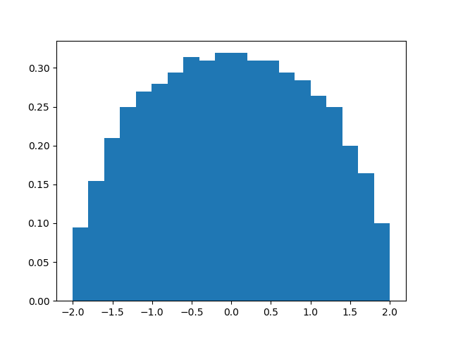

########
Examples
########

.. _clt:

*************************
The central limit theorem
*************************

Let ``X`` be a Bernoulli random variable.

>>> import probly as pr
>>> X = pr.Ber()

We are interested in the sum of many independent copies of ``X``. For this
example, let's take "many" to be 1000.

>>> num_copies = 1000
>>> Z = pr.sum(X, num=num_copies)     # Returns the sum of 1000 independent copies of X

The sum ``Z`` is itself a random variable, but its precise distribution,
unlike that of ``X``, is unknown.

Nevertheless, the central limit theorem states, roughly, that ``Z`` is
approximately normally distributed. We can check this empirically by plotting
a histogram of the distribution of ``Z``.

The more samples of ``Z`` we use to
produce the histogram, the better an approximation it will be to the variable's
true distribution. But each time we sample ``Z``, we must sample 1000 Bernoulli
random variables and sum the results, so computing a histogram from very many
samples can take a long time. Below we use 1000 samples, but you may want to
reduce this number if running the code takes too long.

>>> pr.hist(Z, num_samples=1000)    # doctest: +SKIP

The result resembles the famous bell-shaped curve of the normal distribution.

.. image:: _static/clt_ber_1000_1000.png

*******************
The semicircle law
*******************

A Wigner random matrix is a random symmetric matrix whose upper-diagonal entries
are independent and identically distributed. We can construct a Wigner matrix
using :class:`~probly.Wigner`. For instance, let's create a 1000-dimensional
Wigner matrix with normally distributed entries.

>>> import probly as pr
>>> dim = 1000
>>> M = pr.Wigner(pr.Normal(), dim)

The *semicircle law* states that if we normalize this matrix by dividing by the
square root of 1000, then the eigenvalues of the resulting (random) matrix should
follow the
`semicircle distribution <https://en.wikipedia.org/wiki/Wigner_semicircle_distribution>`_.
Let's check this empirically. First, we normalize ``M`` and then we construct its
(random) eigenvalues by applying NumPy's
`numpy.linalg.eigvals <https://docs.scipy.org/doc/numpy-1.13.0/reference/generated/numpy.linalg.eigvals.html>`_ using :func:`~probly.Lift`.

>>> import numpy as np
>>> M = M / np.sqrt(dim)
>>> Eigvals = pr.Lift(np.linalg.eigvals)
>>> E = Eigvals(M)

The distribution of the eigenvalues can be visualized using the :func:`~probly.hist`
function. Note that we need only take 1 sample.

>>> pr.hist(E, num_samples=1)  # doctest: +SKIP

